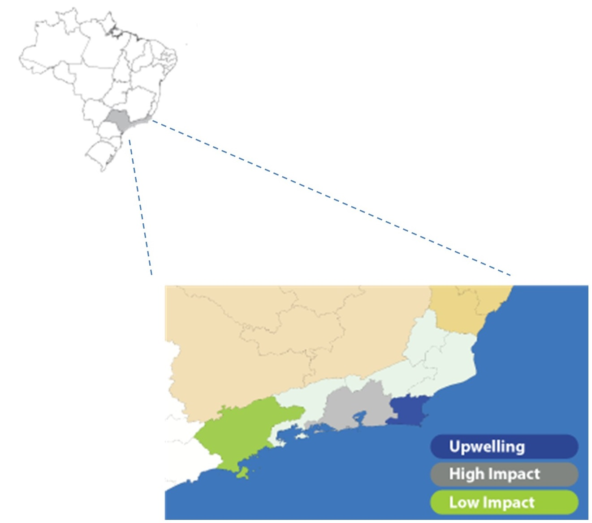
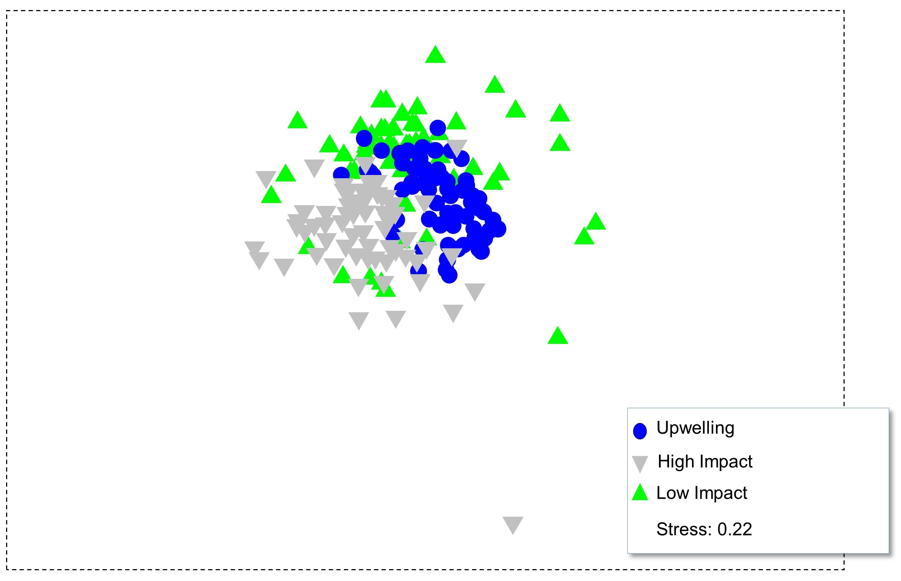
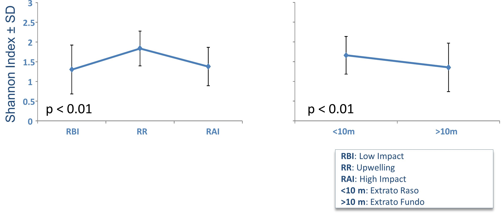
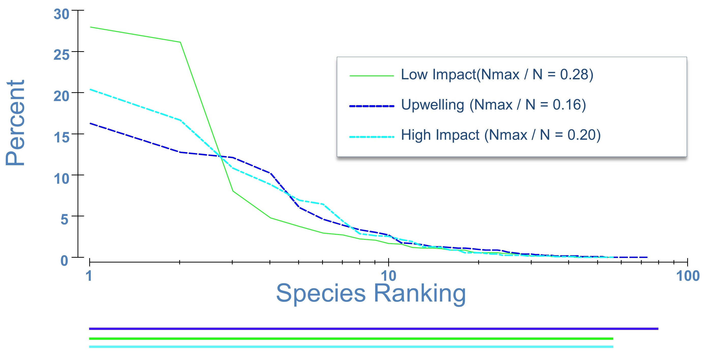

# Diversity Estimates for Reef Communities in Brazil

## Highlights
This a collaborative project between scientists from Brazil and myself. The project entailed investigating the benthic and nectic fauna of an ocean upwelling area to provide a baseline of data for delineating a Marine Protected Area in the region. We conducted univariate and multivariate statistical analyses to find hotzones of biodiversity that could become protected from recreational and commercial fishing, with possible assignment to eco-tourism. Below is the abstract of a presentation to stakeholders and some visuals for depicting the results.

The following tools and analysis were used in this project:
- R for inferential statistics and visualizations
- SQL Server and MySQL for data storage
- Multidimentional scaling, cluster analysis, and permutational analysis of variance was the main analytical approaches

## Abstract and Visuals
Marine Protected Areas are increasingly becoming a tool of choice for conservation and management of marine resources and ecosystems. Data on biodiversity are necessary to assist in establishing protected areas for conservation objectives to be met. Toward that effect, we investigated reef biodiversity patterns in three large-scale coastal regions of Brazil. The study areas comprised of an upwelling region, an adjacent high impacted region, and a more distant marine park. We surveyed four reef sites in each study region. Fish species and abundance, substrate relief, and water temperature were recorded during the surveys. Biodiversity was estimated using Simpson’s and Shannon’s indices on species richness and abundance. Fish diversity was highest at the upwelling area. No difference in diversity was observed between the high impacted region and the marine park. No substrate relief patterns were found. Temperature readings showed higher frequency of low temperature episodic events at the upwelling region. Our results favor the upwelling region for establishment of a Marine Protected Area. Moreover, the similar diversity between the high impacted region and the marine park showed evidence of spillover effects from the upwelling into the high impacted region, further demonstrating the importance of the upwelling region for conservation.

Figure 1. Study area of biodiversity patterns in coastal habitats in Southeastern Brazil. 

Figure 2. Non-metric multidimensional scaling showing distinct biodiversity patterns in three coastal habitats in Southeastern Brazil. 

Figure 3. Analysis of variance of biodiversity patterns in three coastal habitats in Southeastern Brazil. 

Figure 4. Species dominance plots from three coastal habitats in Southeastern Brazil. 

